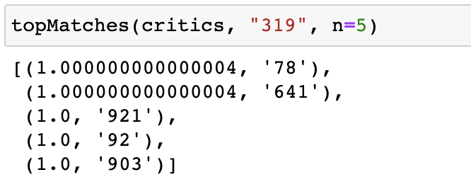
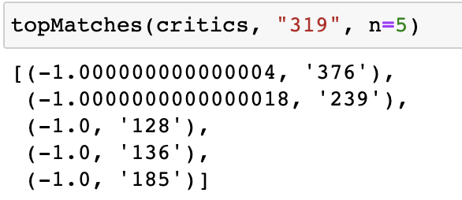

# Homework 7 - Recommendation Systems
**Due:** *Monday*, November 30, 2020 before 11:59pm

## Reports
* CS 432 students *may* complete this report in Markdown. Or, you may choose to use LaTeX instead. 
* CS 532 students *must* complete this report using LaTeX generated to a PDF file (GitHub repo must contain both the LaTeX source and PDF).
* Any graphs required for your reports must be done in R or using a Python plotting library (see ["The 7 most popular ways to plot data in Python"](https://opensource.com/article/20/4/plot-data-python)) -- Excel graphs are unacceptable!
* When you include an image in your report, *do not change the [aspect ratio](https://en.wikipedia.org/wiki/Aspect_ratio_(image)) of the image*. If you have trouble with this, ask for help in our Piazza group.

Reports are not just a list of questions and answers, but should include descriptions, screenshots, copy-paste of code output, references, as necessary.  For each question you address, you must describe how you answered the question.  

You may use existing code, but you **must** document and reference where you adapted the code -- give credit where credit is due! *Use without attribution is plagiarism!*

All reports must include your name, class (make sure to distinguish between CS 432 and CS 532), assignment number/title, and date.  You do not need a title page.  

## Assignment 

Write a report that answers and explains your answers to the following questions. Include a description of how you answered the questions. Your GitHub repo should include all scripts, code, output files, images needed to complete the assignment.

The goal of this assignment is to use the basic recommendation principles we have learned to recommend movies for yourself.

### Dataset
The MovieLens datasets were collected by the [GroupLens Research Project](https://grouplens.org/) at the University of Minnesota during the seven-month period from September 19, 1997 through April 22, 1998.  We are using the "100k dataset", available from
https://grouplens.org/datasets/movielens/100k/

There are three files that we will use:

1.  u.data: 100,000 ratings by 943 users on 1682 movies. Each user has rated at least 20 movies. Users and items are numbered
consecutively from 1. The data is randomly ordered. This is a tab separated list of 

```
user id   item id   rating    timestamp
```

The timestamps are Unix seconds since 1/1/1970 UTC.

Example:
```
196     242     3       881250949
186     302     3       891717742
22      377     1       878887116
244     51      2       880606923
166     346     1       886397596
298     474     4       884182806
115     265     2       881171488
```

2.  u.item: Information about the 1682 movies. This is a tab separated list of

```
movie id | movie title | release date | video release date | IMDb URL | unknown | Action | Adventure | Animation |Children's | Comedy | Crime | Documentary | Drama | Fantasy | Film-Noir | Horror | Musical | Mystery | Romance | Sci-Fi | Thriller | War | Western |
```

The last 19 fields are the genres, a 1 indicates the movie is of that genre, a 0 indicates it is not; movies can be in several genres at once. The movie ids are the ones used in the u.data dataset. 

Example:

```
161|Top Gun (1986)|01-Jan-1986||http://us.imdb.com/M/title-exact?Top%20Gun%20(1986)|0|1|0|0|0|0|0|0|0|0|0|0|0|0|1|0|0|0|0 
162|On Golden Pond (1981)|01-Jan-1981||http://us.imdb.com/M/title-exact?On%20Golden%20Pond%20(1981)|0|0|0|0|0|0|0|0|1|0|0|0|0|0|0|0|0|0|0 
163|Return of the Pink Panther, The (1974)|01-Jan-1974||http://us.imdb.com/M/title-exact?Return%20of%20the%20Pink%20Panther,%20The%20(1974)|0|0|0|0|0|1|0|0|0|0|0|0|0|0| 0|0|0|0|0
``` 

3.  u.user: Demographic information about the users. This is a tab separated list of:

```
user id | age | gender | occupation | zip code
```

The user ids are the ones used in the u.data dataset.

Example:
```
1|24|M|technician|85711 
2|53|F|other|94043 
3|23|M|writer|32067 
4|24|M|technician|43537 
5|33|F|other|15213
```

### Example Code
Instead of writing code from scratch, you are encouraged to modify the code from Ch 2 of *Programming Collective Intelligence* that performs movie recommendations from the MovieLens dataset.  Note that there is code that we did not go over in class (contained in `recommendations.py`) that reads in the u.data and u.item files. 

Main source: https://github.com/arthur-e/Programming-Collective-Intelligence/blob/master/chapter2/recommendations.py

Class notebook w/examples: https://github.com/cs432-websci-fall20/assignments/blob/master/432_PCI_Ch02.ipynb

Notes:
* You do not have to write a single Python script that answers all of the questions (think modular!). 
* You do not have write Python code for every operation. If you can answer questions using Unix commands, do so, but include the commands and describe what you did.

## Questions

### Q1
Find 3 users who are closest to you in terms of age, gender, and occupation.  
I only found 2 users that are closest to me they are 102 and 319

For each of those 3 users:
* what are their top 3 (favorite) films?

102 - Titanic (1997), The Peacemaker (1997), and The Terminator, (1984).

319 - Soul Food (1997), The Devil's Advocate (1997), and The game (1997).

* what are their bottom 3 (least favorite) films?

102 - Alien 3 (1992), Batman Forever (1995), and Star Trek V: The Final Frontier (1989).

319 - Bean (1997), George of the Jungle (1997), and Fallen (1998).

Based on the movie values in those 6 tables (3 users X (favorite + least favorite)), choose a user that you feel is most like you.  Feel free to note any outliers (e.g., "I mostly identify with user 123, except I did not like "Ghost" at all").  You can investigate more than just the top 3 and bottom 3 movies to find your best match.

I choose user 319 because they seem to like Science Fiction movies, and I also like Sci-Fi movies. They rated movies that i dont really care for as much with lower ratings.
This user is the *substitute you*.  

### Q2
Which 5 users are most correlated to the *substitute you*? Which 5 users are least correlated (i.e., negative correlation)?

#### 5 most correlated


#### 5 least correlated


### Q3
Compute ratings for all the films that the *substitute you* has not seen.  

Provide a list of the top 5 recommendations for films that the *substitute you* should see.  

#### top 5 recommendations


Provide a list of the bottom 5 recommendations (i.e., films the *substitute you* is almost certain to hate).

#### bottom 5 recommendations 


### Q4
Choose your (the real you, not the *substitute you*) favorite and least favorite film from the data.  For each film, generate a list of the top 5 most correlated and bottom 5 least correlated films. 

#### top 5 most correlated


#### bottom 5 least correlated


Based on your knowledge of the resulting films, do you agree with the results?  In other words, do you personally like / dislike the resulting films?  
* If you have not heard of the recommended movies, search for the movie's trailer on YouTube and watch it before you answer.  If you do this, include the link to the trailer in your report.  For example, the [trailer for "Top Gun (1986)"](https://www.youtube.com/watch?v=xa_z57UatDY) was found by searching for "top gun 1986 trailer" on Google. 

Based on the resulting fimls I do agree with the results. I had to look uo some of the movies since i haven't seen them but I agree with the result. The recommender system seem to depend highly on genre. I do not really care for westerns and I like SciFi movies, the results seem to be in line with this. 

## Extra Credit

### Q5
*(Extra credit, 2 points)*  

Rank all 1682 movies according to the 1997/1998 MovieLens data.  (*Rank*, not rate. These should be 1-1682.) Break any ties based on number of raters (for example, 7.2 with 10,000 raters > 7.2 with 9,000 raters).

Put a file with the full list in your repo.  List the top 10 and bottom 10 movies in your report.

### Q6
*(Extra credit, 4 points)*  

Now rank the same 1682 movies according to [today's IMDB data](https://www.imdb.com/interfaces/).  Note that the IMDB data includes TV shows and other items that aren't movies.

Put a file with the full list in your repo.  List the top 10 and bottom 10 movies in your report.

### Q7
*(Extra credit, 1 point)*

*You must have done both Q5 and Q6 to complete this question.*

Draw a scatterplot where each dot is a film (i.e., 1682 dots).  The x-axis is the MovieLens ranking (Q5) and the y-axis is today's IMDB ranking (Q6).

Are there any interesting outliers?

## Submission

Make sure that you have committed and pushed your local repo to GitHub.  Your repo should contain any code you developed to answer the questions.  Include "Ready to grade @weiglemc @brutushammerfist" in your final commit message. 

Submit the URL of your *report* in Blackboard:

* Click on HW7 under Assignments in Blackboard
* Under "Assignment Submission", click the "Write Submission" button.
* Copy/paste the URL of your report into the edit box
  * should be something like https<nolink>://github.com/cs432-websci-fall20/hw7-recommend-*username*/blob/master/HW7-report.{pdf,md}
* Make sure to "Submit" your assignment.